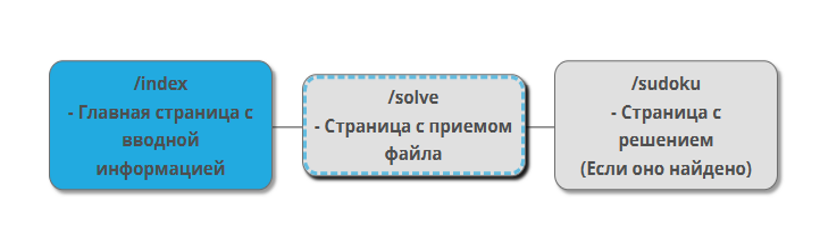
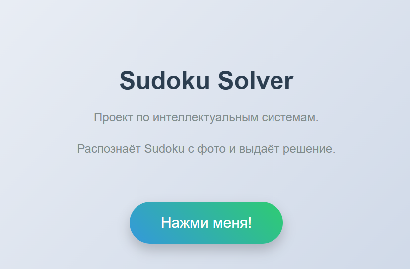
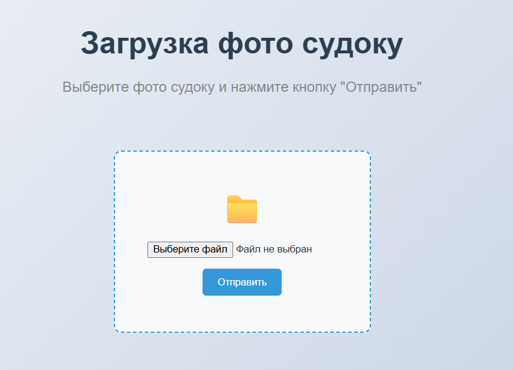
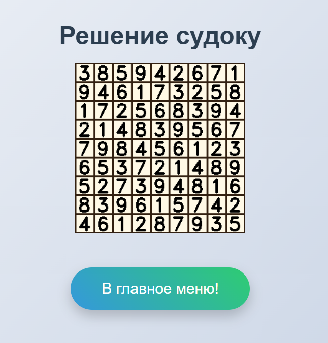

# Sudoku Solver
## Проект по интеллектуальным системам.

### Распознаёт Sudoku с фото и выдаёт решение.

Проект на языке Python - веб-приложение, которое распознаёт Sudoku с фото и выдаёт решение.

Проект состоит из двух частей - сам сайт и алгоритм распознования и решения судоку

## Структура сайта

Сайт реализован на Flask, использованы простые шаблоны HTML и CSS

В случае, если может быть решено:

Иначе:

## Структура "Бэкэнда"

### Компьютерное зрение:
OpenCV – обработка изображений (нахождение сетки Sudoku).

### Машинное обучение:

MNIST-модель (Tensorflow.Keras) – распознавание цифр.

### Алгоритм решения:
Метод backtracking (рекурсивный перебор с возвратом).

## Дальнейшее развитие

Создание API-интерфейса и подключение через тг-бота

